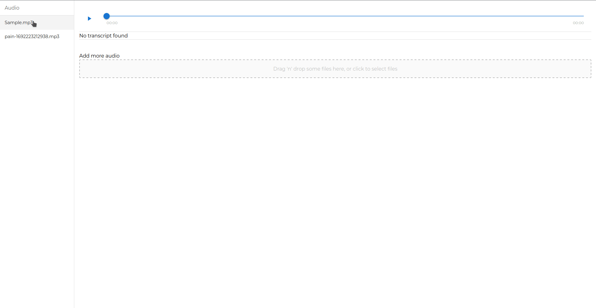

This is a web application for users looking to improve their speech. It allows them to upload audio files, automatically transcribing them and highlighting words which do not meet the threshold.



## To Run Locally

```
$ pip install git+https://github.com/openai/whisper.git
$ git clone https://github.com/Ze-hs/voice_profficiency.git
$ cd voice_profficiency/backend
$ npm start
```

## Built With

-   [Express.js](https://expressjs.com/) - Executes backend logic via REST API
-   [React](https://reactjs.org/) - Used for the frontend
-   [Node.js](https://nodejs.org/) - The runtime environment used
-   [Material UI](https://mui.com/material-ui/) - React library used for the frontend styling
-   [whisper](https://github.com/openai/whisper) - AI tool to transcribe the audio
